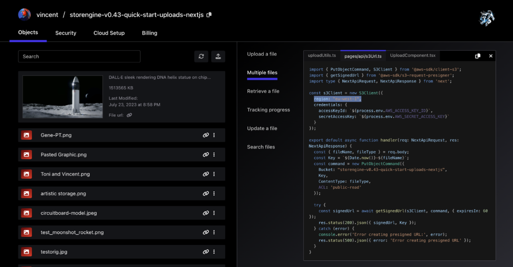

<em>🛜🏃🦾 Turn your AWS account into a personalised Firebase with Netrunner 🛜🏃🦾</em>

 

   
      

<!-- <a href="https://cloudchronicles.substack.com/publish/home">🔗 Blog post</a> -->
&nbsp;&nbsp;•&nbsp;&nbsp;
<a href="https://netrunnerhq.com">🕸️ Website</a>
&nbsp;&nbsp;•&nbsp;&nbsp;
<a href="#-getting-started">🤝 Contribute</a>

## Introducing Netrunner for Next.js and AWS S3

Netrunner streamlines the process of integrating AWS S3 storage into your Next.js application. It is a storage development tool that creates and configures AWS S3 buckets for you, and provides you with instant APIs and code snippets for file uploads.

And it doesn't stop at just configuration - Netrunner also supplies you with file previews for any media and easy-to-use security policy configurations, so that you don't have to reinvent the wheel.

## ✨ UI Screenshot July 22th 2023

 

 

 

## 🎉 Features

- [x] ☁️ AWS S3 bucket creation and secure configuration for file uploads
- [x] 🦾 Ready-to-use code snippets using AWS v3 or Netrunner SDKs
- [x] 🔗 Easy storage, organization, and serving of large files
- [x] 🏞️ Media previews, including videos and images
- [ ] 🔓 Security policy creation from the UI (coming soon)
- [ ] 🧠 Log streaming & OpenAI GPT-4 automated bug fixing (coming soon)
- [ ] 🪐 Lambda functions and database provisioning (coming soon)

Netrunner is currently in closed beta. You can sign up for beta access on the Netrunner [website](https://netrunnerhq.com).

## 👨‍🚀 Getting Started

The easiest way to get started with Netrunner is the automatic setup CLI available on [npm](https://www.npmjs.com/package/@storengine/client). The cli sets up the following for Netrunner:

- Environment variables.
- Example code repository
- A quickstart S3 bucket in your cloud account

Before you get started, please make sure you have the following installed:

- Netrunner API keys (available after signup)
- AWS SDK and CLI
- An OpenAI API key
- Node.js
- Visual studio code

## 🚀 Tech Stack

- ✅ Framework: Nextjs 13 + Typescript + FastAPI
- ✅ Auth: Auth0.js
- ✅ Database: MongoDB.
- ✅ Styling: TailwindCSS + RadixUI.
- ✅ Infrasturcture as a code: Terraform + CloudFormation
- ✅ Cloud platform: AWS

## 🦾 About Netrunner

We are on a mission to enable JavaScript software engineers to transform their AWS cloud account into an AI-powered, personalised Firebase developer platform. Learn more by visiting our [website](https://netrunnerhq.com).
