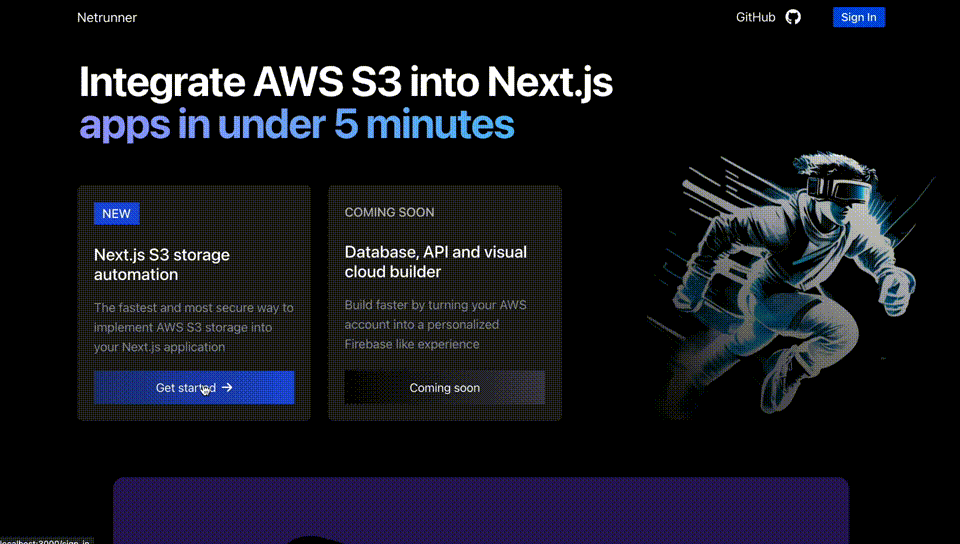
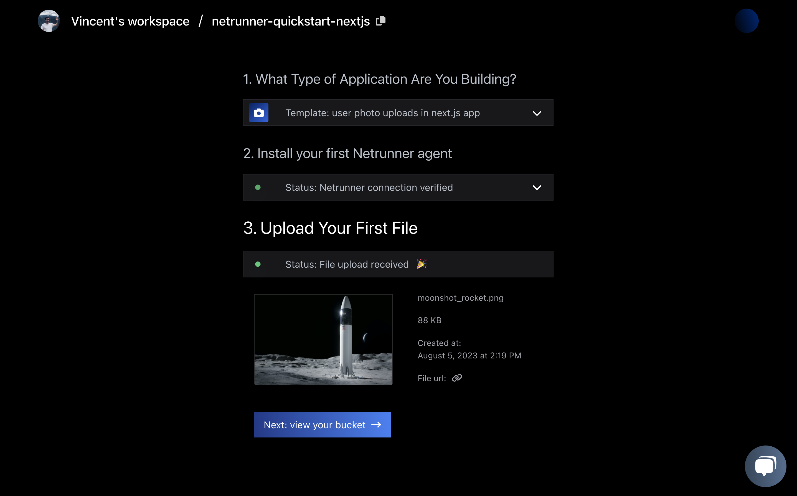

<h2 align="center">
⚡️ Implement AWS S3 In Your Next.js App In Under 5 Minutes
</h2>

<p align="center">
  
</p>

<p align="center">
<a href="https://netrunnerhq.com">👩‍💻 Demo</a>
<span>&nbsp;&nbsp;•&nbsp;&nbsp;</span>
<a href="/example/">🦾 Examples</a
<span>&nbsp;&nbsp;•&nbsp;&nbsp;</span>
<a href="https://netrunnerhq.com">🕸️ Website</a>
<span>&nbsp;&nbsp;•&nbsp;&nbsp;</span>
<a href="#-getting-started">🤝 Contribute</a>
</p>
<h1></h1>

Netrunner is a batteries included tool to implement secure AWS storage in Next.js apps. Unlike other tools, it also solves the problem of configuring S3 buckets in your AWS account. Here's how it works:

1. Automatically configures an S3 bucket in your AWS account using best practice CORS and IAM policies.
2. Implement file uploads in a couple lines of code through an npm package.
3. View and manage files in a helpfull UI dashboard.

## 🪄 Get started with Next.js and AWS S3 file uploads

<!-- @todo: follow Xata.io or Stripe documentation to make it clean-->

Make sure you have a Next.js app and AWS account at the ready. Let's get started!

### 🔋 Step 1. Package installation

First install the Netrunner [npm](https://npmwebsite.com) package to handle file uploads.

```console
npm install @netrunner/next-s3
```

```console
yarn add @netrunner/next-s3
```

```console
pnpm add @netrunner/nextjs-s3
```

### 🌱 Step 2. Implement file upload component

When using app router:

```tsx
// app/upload-page.tsx or for page router: pages/upload-page.tsx
import { useFileUpload } from "netrunnerhq/next-s3-upload";

export default function UploadComponent() {
  const { FileUploadInput, uploadFile } = useFileUpload();
  return <FileUploadInput handleUpload={uploadFile} />;
}
```

### 🔌 Step 3. Create a new API route

```tsx
// app/upload/route.ts or for page router: pages/api/upload.ts
import { apiSignS3Url } from "@netrunnerhq/client";

export default async function handler(req, res) {
  if (req.method !== "GET")
    return res.status(405).json({ message: "Method not allowed" });

  if (!req.query.filename || !req.query.filetype)
    return res.status(400).json({ message: "Missing filename or filetype" });

  try {
    const { filename, filetype } = req.query;
    const { signed_url } = await apiSignS3Url(filename, filetype);
    res.status(200).json({ signed_url });
  } catch (error) {
    console.error(error);
    res.status(500).json({ error: "An error occurred" });
  }
}
```

### 🪣 Step 4. Bucket configuration

Deploy an S3 bucket on your AWS account by logging in with GitHub and following the quickstart on [netrunnerhq.com](https://netrunnerhq.com/). Enter your AWS account ID that you can find on the right top of the AWS console. This will provide Netrunner with the required IAM permissions to deploy a secure S3 bucket for you with instant to use code snippets:

<p align="center">
  
</p>

### 🎉 Step 5. Upload file and finish!

Verify in your AWS console if the bucket is deployed correctly in the S3 service [page](https://s3.console.aws.amazon.com/s3/home?region=us-east-1) and upload a file as a last step:

<p align="center">
  
</p>

## 🦾 About Netrunner

Netrunner is being developed by [Vincent Hus](https://github.com/davincios) with the mission to enable JavaScript software engineers to transform their AWS cloud account into a personalised Firebase developer platform.

You can learn more by visiting our [website](https://netrunnerhq.com) or ping Vincent on twitter [@jvf_hus](https://twitter.com/vincent_hus)
